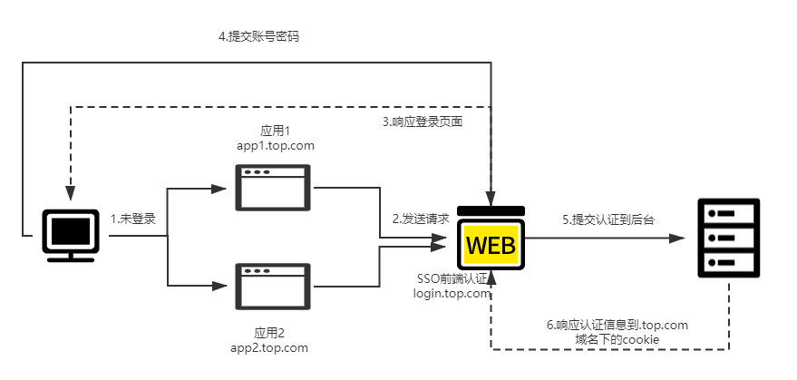
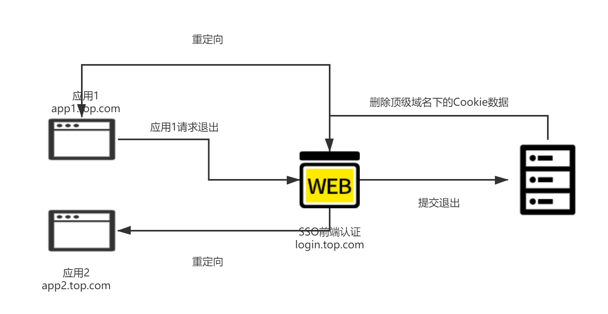
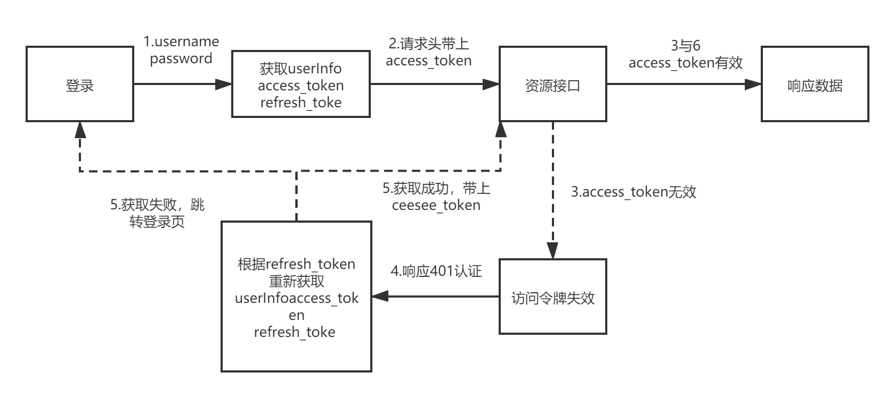

# blog-auth-center

## SSO单点登录系统

### 登录流程图

### 退出流程图

1.接收所有应用的退出请求

2.调用后台退出接口

3.删除顶级域名下的Cookie

4.重定向

### 刷新Token流程图

1.当应用系统请求后台资源接口时，要在请求头带上 accessToken 去请求接口，如果 accessToken 有效，资源服务
器正常响应数据。

2.如果访问令牌 accessToken 过期，资源服务器会响应 401 状态码 。当应用系统接收到 401 状态码时，通过刷新令
牌 refreshToken 获取去请求新令牌完成新的重新身份